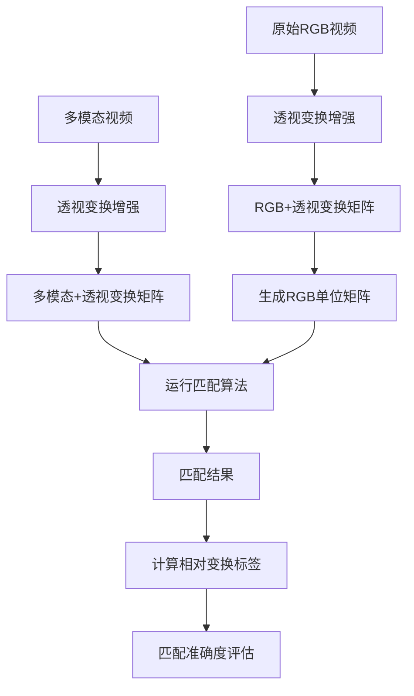

# 透视变换数据增强完整工作流程

## 📖 概述

本工作流程为多模态视频特征匹配任务提供完整的透视变换数据增强解决方案，包括数据增强、标签生成和匹配准确度评估。

## 🎯 工作流程架构



## 🛠️ 脚本工具

### 1. `perspective_augmentation.py` - 透视变换数据增强
**用途**: 对多模态视频进行透视变换增强
```bash
python utils/perspective_augmentation.py \
    --input_dir /mnt/mDisk2/APIDIS/mm \
    --output_dir /mnt/mDisk2/APIDIS_P/mm \
    --max_shift 0.05 \
    --seed 42
```

**输出**:
- 透视变换后的视频文件（保持原始文件名）
- `*_perspective_matrix.npy`: 透视变换矩阵
- `*_perspective_params.json`: 变换参数记录

### 2. `generate_identity_matrices.py` - RGB单位矩阵生成
**用途**: 为RGB视频生成对应的单位矩阵文件，统一处理流程
```bash
python utils/generate_identity_matrices.py \
    --input_dir /mnt/mDisk2/APIDIS/mp4 \
    --output_dir /mnt/mDisk2/APIDIS_P/mp4
```

**输出**:
- `*_perspective_matrix.npy`: 3×3单位矩阵
- `*_perspective_params.json`: 矩阵参数信息

### 3. `calculate_relative_transforms.py` - 相对变换标签计算
**用途**: 计算匹配模态对之间的相对透视变换关系作为标签
```bash
python utils/calculate_relative_transforms.py \
    --rgb_dir /mnt/mDisk2/APIDIS_P/mp4 \
    --mm_dir /mnt/mDisk2/APIDIS_P/mm \
    --output_dir /mnt/mDisk2/APIDIS_P/MultiModal_Output
```

**输出**:
- `relative_transform_matrix.npy`: 相对透视变换矩阵（标签）
- `relative_transform_params.json`: 相对变换参数和元数据

## 📁 目录结构

### 输入目录结构
```
/mnt/mDisk2/APIDIS/
├── mp4/                    # 原始RGB视频
│   ├── A1.mp4
│   ├── A2.mp4
│   └── ...
└── mm/                     # 原始多模态数据
    ├── A1/
    │   ├── A1_frequency_domain.mp4
    │   ├── A1_motion_thermal.mp4
    │   └── ...
    └── A2/
        ├── A2_frequency_domain.mp4
        └── ...
```

### 处理后目录结构
```
/mnt/mDisk2/APIDIS_P/
├── mp4/                    # RGB + 单位矩阵
│   ├── A1.mp4
│   ├── A1_perspective_matrix.npy
│   ├── A1_perspective_params.json
│   └── ...
├── mm/                     # 透视变换后的多模态数据
│   ├── A1/
│   │   ├── A1_frequency_domain.mp4
│   │   ├── A1_frequency_domain_perspective_matrix.npy
│   │   ├── A1_frequency_domain_perspective_params.json
│   │   └── ...
│   └── ...
└── MultiModal_Output/      # 匹配结果 + 相对变换标签
    └── A1/
        └── FreqDomain_vs_MotionThermal/
            ├── MatchResult/
            ├── relative_transform_matrix.npy
            └── relative_transform_params.json
```

## 🔄 完整工作流程

### 步骤1: 数据增强
```bash
# 1. 对多模态视频进行透视变换
python utils/perspective_augmentation.py \
    --input_dir /mnt/mDisk2/APIDIS/mm \
    --output_dir /mnt/mDisk2/APIDIS_P/mm \
    --max_shift 0.05 \
    --seed 42

# 2. 为RGB视频生成单位矩阵
python utils/generate_identity_matrices.py \
    --input_dir /mnt/mDisk2/APIDIS/mp4 \
    --output_dir /mnt/mDisk2/APIDIS_P/mp4
```

### 步骤2: 运行匹配算法
```bash
# 使用现有的批处理脚本，但路径指向增强后的数据
./multimodal_batch.sh
# 注意：需要修改脚本中的路径为 /mnt/mDisk2/APIDIS_P/
```

### 步骤3: 生成匹配标签
```bash
# 计算相对透视变换关系作为标签
python utils/calculate_relative_transforms.py \
    --rgb_dir /mnt/mDisk2/APIDIS_P/mp4 \
    --mm_dir /mnt/mDisk2/APIDIS_P/mm \
    --output_dir /mnt/mDisk2/APIDIS_P/MultiModal_Output
```

### 步骤4: 匹配准确度评估
```bash
# 使用现有的分析脚本，包含相对变换标签
python utils/analyze_match_results.py \
    --output_dir /mnt/mDisk2/APIDIS_P/MultiModal_Output
```

## 🧮 数学原理

### 透视变换关系
假设原始视角为 I，两个模态经过透视变换后：
- `modality1 = I × H1`
- `modality2 = I × H2`

### 相对变换计算
要将 modality1 对齐到 modality2，相对变换关系为：
```
H_relative = H2 × H1^(-1)
```

这样：
```
modality1 × H_relative = (I × H1) × (H2 × H1^(-1)) = I × H2 = modality2
```

### 匹配准确度评估
在评估匹配准确度时，使用 `H_relative` 作为真值标签：
1. 将匹配点通过 `H_relative` 进行变换
2. 计算变换后的点与实际匹配点之间的误差
3. 统计在不同误差阈值下的准确率

## ⚙️ 配置参数

### 透视变换参数
- `max_shift`: 最大偏移比例（推荐 0.03-0.08）
- `seed`: 随机种子（确保可重现）

### 匹配算法参数
- 保持现有的匹配算法参数不变
- 使用增强后的数据作为输入

### 评估参数
- 使用相对变换矩阵作为真值标签
- 支持多种误差阈值评估

## 📊 评估指标

### 新增指标
- **变换距离**: 相对变换矩阵与单位矩阵的Frobenius范数
- **数值稳定性**: 矩阵条件数
- **变换类型**: 矩阵行列式值

### 传统指标
- 像素级准确率（多个阈值）
- 匹配点保留率
- RANSAC内点比例

## 🔍 故障排除

### 常见问题

1. **矩阵文件未找到**
   - 检查文件命名格式
   - 确认透视变换步骤已完成
   - 验证路径配置

2. **矩阵计算错误**
   - 检查矩阵是否为奇异矩阵
   - 验证矩阵条件数
   - 确认输入矩阵格式正确

3. **匹配结果目录结构错误**
   - 确认匹配算法已运行
   - 检查目录命名格式
   - 验证模态名称映射

### 调试技巧

1. **使用示例脚本测试**
   ```bash
   python utils/example_perspective_usage.py
   python utils/example_relative_transforms_usage.py
   ```

2. **检查中间结果**
   - 验证透视变换矩阵的合理性
   - 检查相对变换矩阵的数值稳定性
   - 确认文件路径和命名正确

3. **分步骤调试**
   - 先处理单个场景
   - 逐步增加处理范围
   - 对比处理前后的结果

## 📚 相关文档

- [透视变换数据增强文档](README_perspective_augmentation.md)
- [匹配结果分析文档](../analyze_match_results.py)
- [OpenCV 透视变换文档](https://docs.opencv.org/4.x/da/d54/group__imgproc__transform.html)

## 🤝 使用建议

1. **数据备份**: 在处理前备份原始数据
2. **参数调优**: 从小的变换强度开始测试
3. **批量处理**: 使用脚本自动化整个流程
4. **结果验证**: 定期检查中间结果的合理性
5. **性能监控**: 关注处理时间和内存使用

## 📝 更新日志

- **v1.0**: 初始版本，支持基础透视变换增强
- **v1.1**: 添加RGB单位矩阵生成功能
- **v1.2**: 实现相对变换标签计算
- **v1.3**: 完善文档和示例脚本
